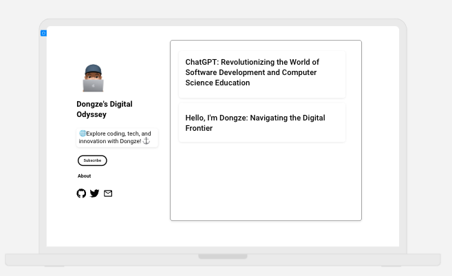
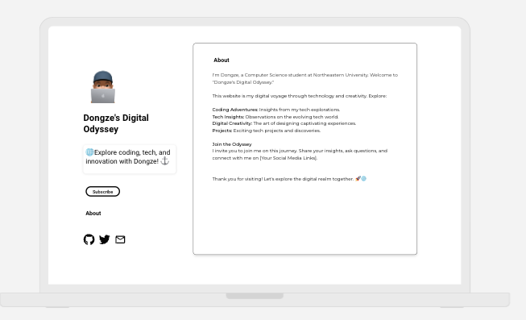
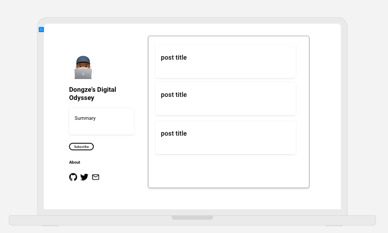

# Design Document for Dongze's Personal Homepage

## Project Description

The project involves creating a personal homepage for Dongze Li, a web developer and technology enthusiast. This homepage will serve as a platform to showcase Dongze's work, share blog posts, provide information about him, and allow visitors to contact him.

## User Personas

### 1. Dongze's Potential Employers

- **Background:** HR managers, tech leads, and potential employers interested in evaluating Dongze's skills and experience.
- **Needs:** Access to Dongze's resume, portfolio, and blog posts to assess his qualifications.

### 2. Tech Enthusiasts

- **Background:** People interested in web development and technology.
- **Needs:** Access to Dongze's blog posts and projects to learn from his experiences and insights.

## User Stories

### 1. As a Potential Employer, I Want to:

- Access Dongze's resume.
- View his portfolio of web development projects.
- Read his blog posts to gauge his knowledge and expertise.
- Find contact information for potential job inquiries.

### 2. As a Tech Enthusiast, I Want to:

- Read Dongze's blog posts to learn about web development and technology trends.
- Explore his projects for inspiration and learning opportunities.

## Design Mockups

### Homepage (index.html)

### About Page (about.html)

### Contact Page (contact.html)

## Project Structure

The project structure will consist of the following files and directories:

- index.html
- about.html
- contact.html
- posts/
  - post1.html
  - post2.html
- images/
  - sample-image.png
- css/
  - style.css
- js/
  - main.js
- mockups/
  - homepage_mockup.png
  - about_page_mockup.png
  - contact_page_mockup.png

## Technologies Used

- HTML5
- CSS3
- Bootstrap
- JavaScript
- Font Awesome Icons
- Google Fonts
- MDB (Material Design for Bootstrap)

## Next Steps

1. Create HTML and CSS files for each page.
2. Implement responsive design for mobile and desktop.
3. Develop the blog section and connect it to a backend for managing blog posts.
4. Add functionality to the contact form.
5. Populate the portfolio with Dongze's projects.
6. Write blog posts and update content.
7. Test the website on various browsers and devices.
8. Deploy the website to a hosting service.
9. Continuously update the website with new content and projects.

This design document provides a clear overview of the project's objectives, user personas, user stories, and design mockups. It serves as a roadmap for developing Dongze's personal homepage.
